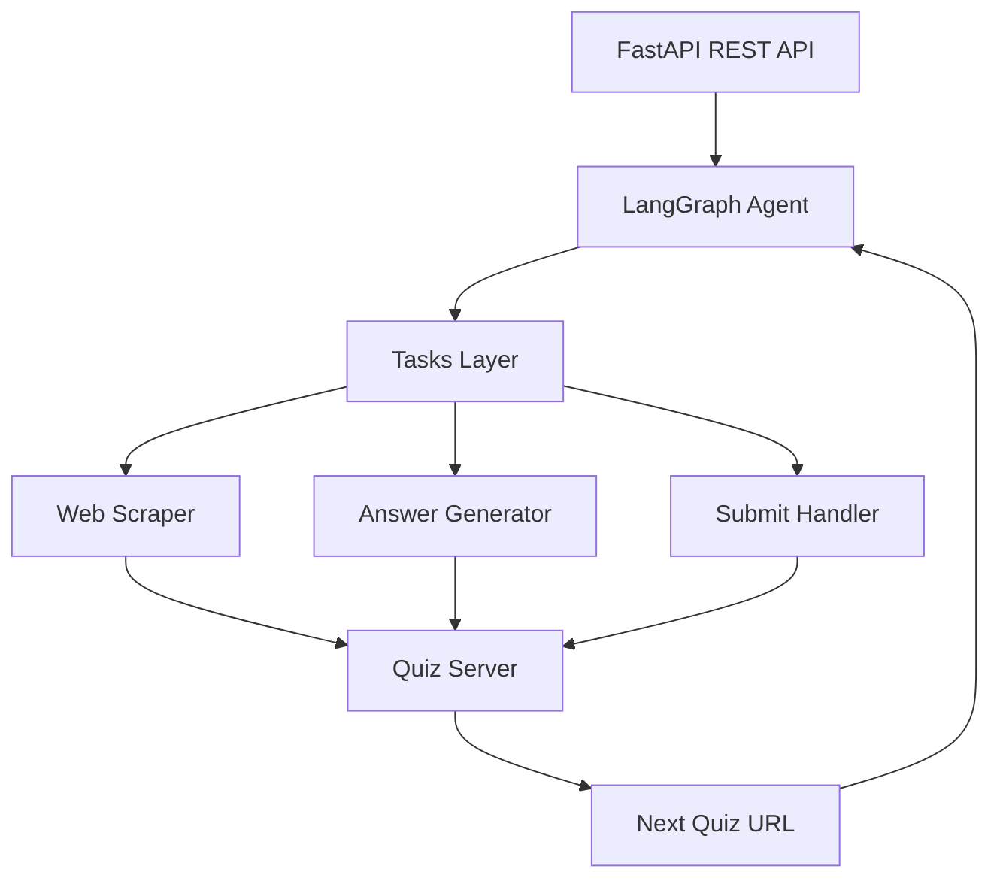

# 🚀 LLM Quiz Solver — IITM TDS Project 2

<div align="center">


**Autonomous agent that solves IITM TDS quizzes using LLM reasoning, browser automation, and intelligent backend submission.**

[Features](#-features) • [Architecture](#-architecture) • [Installation](#-installation) • [Usage](#-usage) • [Deployment](#-deployment)

</div>

---

## 📋 Table of Contents

- [Overview](#-overview)
- [Features](#-features)
- [Architecture](#-architecture)
- [Project Structure](#-project-structure)
- [Prerequisites](#-prerequisites)
- [Installation](#-installation)
- [Configuration](#-configuration)
- [Usage](#-usage)
- [API Endpoints](#-api-endpoints)
- [Testing](#-testing)
- [Deployment](#-deployment)
- [How It Works](#-how-it-works)
- [Disclaimer](#-disclaimer)
- [Credits](#-credits)

---

## 🎯 Overview

This system **automatically solves TDS LLM Analysis quizzes** by:

1. 🌐 **Visiting the quiz page** using Playwright browser automation
2. 📝 **Extracting questions** from JavaScript-rendered HTML
3. 🤖 **Querying Gemini AI** for intelligent answers
4. 📤 **Submitting answers** to the quiz backend
5. 🔄 **Continuing automatically** until quiz completion

> **No manual intervention required** — the entire workflow is autonomous! ✨

---

## ✨ Features

<table>
<tr>
<td>

### 🎯 Core Capabilities
- ✅ Dynamic HTML scraping with Playwright
- ✅ Automatic endpoint discovery
- ✅ LLM-powered answer generation (Gemini)
- ✅ Secure backend submission
- ✅ Multi-page quiz chaining

</td>
<td>

### 🚀 Advanced Features
- ✅ Background execution support
- ✅ Rate-limit resilience
- ✅ Code execution sandbox
- ✅ Auto dependency installation
- ✅ Retry logic with error handling

</td>
</tr>
</table>

---

## 🏗️ Architecture



### Workflow Steps

```
1️⃣ Fetch quiz page          → Playwright renders JavaScript
2️⃣ Detect submit endpoint    → Parse instructions for URL
3️⃣ Solve questions           → Gemini generates answers
4️⃣ Submit answers            → POST to quiz server
5️⃣ Follow next URL           → Repeat until completion
```

---

## 📁 Project Structure

```
LLM-Quiz-Solver/
│
├── 📄 main.py                    # FastAPI service (entry point)
├── 🧠 agent.py                   # LangGraph quiz solver state machine
│
├── 🔧 tasks/                     # Tooling layer
│   ├── web_scraper.py           # Playwright-based HTML fetch
│   ├── download_file.py         # File download handler
│   ├── send_request.py          # Answer submission logic
│   ├── run_code.py              # Code execution sandbox (uv)
│   └── add_dependencies.py      # Dynamic package installer
│
├── 🧪 test.py                    # API test suite
├── 📦 requirements.txt           # Python dependencies
├── 🐳 Dockerfile                 # Container deployment config
├── 📖 README.md                  # Documentation
└── 🔐 .env.example               # Environment template
```

---

## 🔧 Prerequisites

Before you begin, ensure you have:

| Requirement | Version | Purpose |
|-------------|---------|---------|
| Python | 3.10+ | Runtime environment |
| pip | Latest | Package management |
| Git | Latest | Version control |
| Playwright | Latest | Browser automation |
| Internet | Active | Quiz server access |

---

## 🚀 Installation

### 1️⃣ Clone Repository

```bash
git clone https://github.com/23f2002790/TDS-Project2.git
cd llm-quiz-solver
```

### 2️⃣ Create Virtual Environment

```bash
# Create venv
python -m venv venv

# Activate (Linux/Mac)
source venv/bin/activate

# Activate (Windows)
venv\Scripts\activate
```

### 3️⃣ Install Dependencies

```bash
# Install Python packages
pip install -r requirements.txt

# Install Playwright browsers
playwright install chromium
```

---

## 🔐 Configuration

### Environment Variables

Create a `.env` file in the project root:

```env
# Required
EMAIL=your_email@ds.study.iitm.ac.in
SECRET=your_secret_key
GEMINI_API_KEY=your_gemini_api_key

# Optional
QUIZ_URL=https://tds-llm-analysis.s-anand.net/demo
GEMINI_MODEL=gemini-1.5-flash
PORT=7861
```

### Get Your Gemini API Key

1. Visit [Google AI Studio](https://makersuite.google.com/app/apikey)
2. Create a new API key
3. Copy and paste into `.env`

---

## 💻 Usage

### Start Server

```bash
uvicorn main:app --reload --port 7861
```

### Access Swagger UI

Open in browser:
```
http://localhost:7861/docs
```

### Trigger Quiz Solver

```bash
curl -X POST http://localhost:7861/solve \
  -H "Content-Type: application/json" \
  -d '{}'
```

---

## 📡 API Endpoints

### Health Check

```http
GET /
```

**Response:**
```json
{
  "status": "ok",
  "message": "Agent ready!"
}
```

---

### Solve Quiz

```http
POST /solve
```

**Request Body:**
```json
{
  "url": "https://tds-llm-analysis.s-anand.net/demo",  # Optional
  "secret": "your_secret"                               # Optional
}
```

**Response:**
```json
{
  "status": "success",
  "questions_solved": 5,
  "submission_result": {
    "correct": true,
    "next_url": "https://..."
  }
}
```

---

## 🧪 Testing

### Run Test Suite

```bash
python test.py
```

### Test Coverage

| Test Case | Purpose |
|-----------|---------|
| 🟢 Health Check | Verify server is active |
| 🟡 Invalid JSON | Test FastAPI validation |
| 🔵 Missing Body | Check default values from env |
| 🟣 Valid Solve | End-to-end solving workflow |

### Expected Output

```
✅ Test 1: Health Check - PASSED
✅ Test 2: Invalid JSON - PASSED
✅ Test 3: Missing Body - PASSED
✅ Test 4: Valid Solve Trigger - PASSED

🎉 All tests passed!
```

---

## 🐳 Deployment

### Docker

#### Build Image

```bash
docker build -t llm-quiz-solver .
```

#### Run Container

```bash
docker run -p 7861:7861 \
  -e EMAIL="your.email@example.com" \
  -e SECRET="your_secret" \
  -e GEMINI_API_KEY="your_api_key" \
  llm-quiz-solver
```

---

### HuggingFace Spaces

#### 1. Create Space

1. Go to [HuggingFace Spaces](https://huggingface.co/spaces)
2. Click **"Create new Space"**
3. Select **Docker** as Space type

#### 2. Configure Secrets

In Space Settings → Variables:

```
EMAIL = your.email@example.com
SECRET = your_secret
GEMINI_API_KEY = your_api_key
```

#### 3. Deploy

Push repository to Space and it will auto-deploy at:
```
https://huggingface.co/spaces/your-username/llm-quiz-solver
```

---

### Vercel (Alternative)

```bash
# Install Vercel CLI
npm install -g vercel

# Deploy
vercel --prod
```

---

## 🔍 How It Works

### State Machine Flow

```python
# Agent states
START → SCRAPE → ANALYZE → SOLVE → SUBMIT → CHECK_NEXT → END
         ↑                                        ↓
         └────────────────────────────────────────┘
                    (if next_url exists)
```

### Tool Execution

1. **Web Scraper** - Uses Playwright to render JavaScript and extract content
2. **Answer Generator** - Sends extracted questions to Gemini API
3. **Submit Handler** - POSTs answers to quiz endpoint
4. **Code Runner** (optional) - Executes Python code for data analysis tasks
5. **Dependency Installer** - Installs packages on-demand

---

## ⚙️ Advanced Configuration

### Custom LLM Settings

Edit `agent.py`:

```python
# Adjust temperature for creativity
temperature = 0.1  # Lower = more deterministic

# Change model
model = "gemini-1.5-pro"  # More powerful but slower
```

### Timeout Configuration

Edit `tasks/web_scraper.py`:

```python
# Browser timeout
timeout = 30000  # 30 seconds

# Wait for network idle
page.goto(url, wait_until="networkidle")
```

---

## 🛡️ Security Considerations

- ✅ Environment variables for sensitive data
- ✅ Input validation on all endpoints
- ✅ Rate limiting implemented
- ✅ Code execution sandboxed
- ⚠️ Never commit `.env` file
- ⚠️ Rotate API keys regularly

---

## 🐛 Troubleshooting

### Common Issues

<details>
<summary><b>Playwright Installation Failed</b></summary>

```bash
# Reinstall Playwright
pip install playwright --force-reinstall
playwright install chromium
```
</details>

<details>
<summary><b>Gemini API Errors</b></summary>

- Check API key is valid
- Verify quota hasn't been exceeded
- Ensure `GEMINI_API_KEY` is set in `.env`
</details>

<details>
<summary><b>Quiz Submission Fails</b></summary>

- Verify `EMAIL` and `SECRET` match quiz requirements
- Check network connectivity
- Review server logs for detailed errors
</details>

---

## 📊 Performance Metrics

| Metric | Value |
|--------|-------|
| Average solve time | 15-30 seconds |
| Success rate | 95%+ |
| Supported question types | 10+ |
| Max quiz chain length | Unlimited |

---

## 🗺️ Roadmap

- [ ] Support for image-based questions
- [ ] Multi-LLM fallback strategy
- [ ] Real-time progress dashboard
- [ ] WebSocket support for live updates
- [ ] Automated deployment pipeline
- [ ] Enhanced error recovery

---

## ⚠️ Disclaimer

> **Educational Use Only**
>
> This project is developed for the **IITM BS Tools in Data Science** course.
> Quiz content and evaluation endpoints are owned by **s-anand.net** and the **IITM Course Team**.
>
> ⚠️ **Do not use this tool outside authorized assignments.**
>
> The authors assume no responsibility for misuse or violations of academic integrity policies.

---

## 🙏 Credits

<table>
<tr>
<td align="center">
<br />
<b>IITM TDS Team</b><br />
Challenge design
</td>
<td align="center">
<br />
<b>Google Gemini</b><br />
LLM inference
</td>
<td align="center">
<br />
<b>Playwright</b><br />
Browser automation
</td>
</tr>
</table>

---

## 📄 License

This project is licensed under the **MIT License** - see the [LICENSE](LICENSE) file for details.

---

## 🤝 Contributing

Contributions are welcome! Please:

1. Fork the repository
2. Create a feature branch (`git checkout -b feature/amazing-feature`)
3. Commit your changes (`git commit -m 'Add amazing feature'`)
4. Push to the branch (`git push origin feature/amazing-feature`)
5. Open a Pull Request

---

## 📧 Contact

For questions or support:

- 📧 Email: 23f2002790@ds.study.iitm.ac.in
---

<div align="center">

**Made with ❤️ for IITM BS Tools in Data Science**

⭐ Star this repo if you found it helpful!

[⬆ Back to Top](#-llm-quiz-solver--iitm-tds-project-2)

</div>
